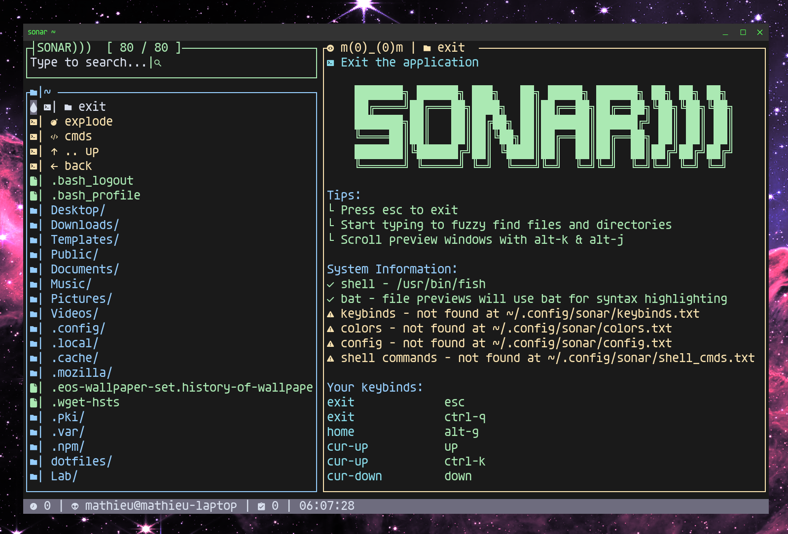

# Sona
A friendly, fuzzy find first, file manager for your terminal. 



## Features
- Fuzzy Find First
    - Navigate directories via fuzzy find
- Custom Keybinds
    - All UI actions (cmds) can be mapped to custom keys
- Multi-select operations
    - Copy, move, delete (etc) multiple files at a time
- Async file operations
    - No UI lockups when moving large files
- Responsive layout
    - Supports vertical and horizontal layouts with a custom breakpoint
- Optional bat integration
    - If you have bat installed, it will be used to preview files in the TUI
- Custom native shell commands
    - Supports an "alias-like" syntax for writing custom commands which can operate on your file multi-selection 
- Image preview
    - Sixels in supported environments
    - Unicode half-blocks if not
- Discoverable commands and features
    - All commands can be found and launched via the TUI
    - No need to scour the docs

## Check it out
The best way to check out Sona right now is to build it yourself with `cargo`. 

Clone this repo and simply run:

```sh
cargo run --release
```

## Commands

Commands are how you interact with Sona. Most useful commands have a default keybinding but they can be remapped and called manually as needed. 

```
cmd-find         : Toggle the fuzzy command finder
cmd-list         : List all commands in the output window
cmd-list-dump    : Dump all commands to a file
cmd-win          : Toggle command window where you can type commands
config-clear     : Clear (delete) the configuration files
config-init      : Initialize the configuration files with defaults
cur-down         : Move selection cursor down
cur-up           : Move selection cursor up
dbg-prev-clear   : Clear the screen content. Some terminals may not refresh properly causing artifacts.
dir-back         : Go back to the most recent working directory
dir-reload       : Reload the current working directory
dir-up           : Go up to the parent directory
edit             : Open the focused file or directory in $EDITOR
enter            : Open/Edit/Run the item under the cursor
exit             : Exit the application
explode          : Find all files in subdirectories under the current directory
goto             : Go to a specified directory
home             : Go to your home directory
input-clear      : Clear the current input/search
keybinds-show    : Show the currently loaded keybindings
log              : Show the application log
log-clear        : Clear the application log
menu-back        : Go back to previous menu
output-hide      : Hide the output window
output-show      : Show the output window
output-toggle    : Toggle the output window
sec-down         : Scroll the secondary window down
sec-up           : Scroll the secondary window up
sel              : Toggle selection of the item under the cursor
sel-clear        : Clear the current selection of files and directories
sel-clip         : Copy the current selection of file and diretory paths to clipboard
sel-copy         : Copy the current selection of files and directories to the current directory
sel-delete       : Delete all currently selected files and directories
sel-move         : Move (not copy) the currently selected files and directories to the current directory
sel-save         : Save the current selection of files and directories to file
sel-show         : Show the current selection of files and directories in the output window
shell            : Run a quick shell command in the current directory
shell-full       : Run a full shell in the current directory
```

## Configuration

### Keybinds

Keybinds can be defined in the `keybinds.txt` file in your config directory. Any command can be mapped to a keybind. Defining ANY custom keybinds will cause the app to completely ignore the default keybinds. 

The default keybinds are as follows:
```
#
# Default keybinds
#

exit        esc
exit        ctrl-q
home        alt-h
cur-up      up
cur-up      ctrl-k
cur-down    down
cur-down    ctrl-j
sel         tab
dir-up      ctrl-h
dir-back    ctrl-u
explode     ctrl-x
edit        ctrl-e
goto        ctrl-g
enter       enter
enter       ctrl-l
cmd-win     ctrl-w
cmd-find    ctrl-t 
cmd-list    ctrl-i
sec-up      alt-k
sec-down    alt-j
input-clear ctrl-z
shell       ctrl-s
```

### Colors

While the actual color values used in the TUI are decided by your terminal theme, you can define which colors get used for which elements in your `colors.txt` file. Setting custom colors here will override the default colors but any element which does not have a custom color set will fall back to the default.

```
#
# Default colors
#

name           default
search_border  green
preview_border yellow
listing_border blue
file           green
dir            blue
command        cyan
executable     lightred
shortcut       yellow
image          lightmagenta
header         lightblue
info           yellow
tip            green
warning        yellow
error          red
ok             green
hi             white
dim            gray
misc           white
```

### General Configuration

General config options are stored in the `config.txt` file. These options control the behavior of Sona. Options which are not set here fall back to the default values.  

```
#
# Default configuration
#

# Command to run when you 'enter' on a file/directory
cmd_on_enter     edit

# How many items to show in a list - 0 = no limit
list_limit       100

# How many items can be searched at once - 0 = no limit
find_limit       0

# How many lines to preview - 0 = no limit
preview_limit    100

# Whether to force sixel image rendering (if terminal supports it)
force_sixel      false

# Maximum image width in characters
max_image_width  80

# Responsive breakpoint in characters
responsive_break 100
```

### Custom Shell Commands

It's possible to define custom shell commands which can be launched from the TUI `cmd-finder`. These shell commands can harness your file/directory multi-selection.

> [!TIP]
> It's also possible to run native shell commands manually with the `shell` command. 

```
#
# Default shell commands
#

# A simple command
ls -la
# Ask for input (open prompt window)
ls {ASK}
# Echo the first selected file/directory
echo $1
# Create a zip archive of all selected files/directories
zip -r archive.zip $...
```


